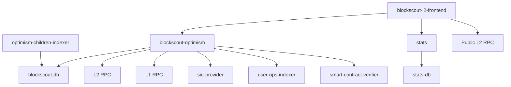

# Arkiv L2 Explorer

## Overview



Arkiv L2 Explorer has a modular, micro-service architecture.

* `blockscout-optimism` - main backend service, responsible for indexing the chain and providing APIs
* `stats` - helper micro-service providing analytics and statistical data
* `blockscout-l2-frontend` - Next.js web application that's the frontend for the Explorer
* `Public L2 RPC`, `L2 RPC`, `L1 RPC` - Ethereum-compatible JSON-RPC endpoints to chain nodes
* `sig-provider` - helper micro-service that maps 4-byte selectors to detailed call & event signatures
* `user-ops-indexer` - helper micro-service for indexing ERC-4337 operations (account abstraction)
* `smart-contract-verifier` - helper micro-service for verifying smart contract source code in the Explorer
* `optimism-children-indexer` - helper micro-service for indexing & mapping L2 <-> L3 deposits and withdrawals

## Sample deployment

See [example Docker Compose](./l2explorer.arkiv.neti-soft.dev) project.

## Databases

Arkiv L2 explorer requires 2 separate PostgreSQL databases - one for `blockscout-optimism` and `optimism-children-indexer`, and one for `stats`.
It was developed for and tested on PostgreSQL 17, but we expect it to be fully compatible with newer versions as well.

## Services details

### `blockscout-optimism`

This is unmodified upstream Blockscout service in the `Optimism` variant. See [upstream docs](https://docs.blockscout.com/setup/env-variables/backend-env-variables) for a complete reference.

Configuration recommended by us can be found in [the example project](./l2explorer.arkiv.neti-soft.dev/envs/backend.env)

For production deployment, you want to modify the following variables:

* `DATABASE_URL` - `postgresql://` url for DB connection
* `SECRET_KEY_BASE` - secret key for encrypting cookies
* `ETHEREUM_JSONRPC_*` - connection parameters to L2 RPC endpoint. Expect a significant load on the endpoint, as it will fetch all blocks, transactions and traces of transactions.
* `INDEXER_OPTIMISM_L1_RPC` - connection parameters to L1 RPC endpoint. Used for tracking deposits/withdrawals.
* `MICROSERVICE_*_URL` - connection parameters to micro-services.
* `PORT` - port to listen on
* `CORS_ORIGIN` - should be set to the origin of the `blockscout-l2-frontend`
* `COIN_NAME`, `COUNT`, `CHAIN_ID`, `INDEXER_OPTIMISM_L1_SYSTEM_CONFIG_CONTRACT` - adjust based on the L2 chain details.

### `blockscout-l2-frontend`

This is a fork of the upstream frontend, containing modifications related to tracking L3 data. See [upstream docs](https://docs.blockscout.com/setup/env-variables/frontend-common-envs/envs) for a reference of upstream ENVs.

Configuration recommended by us can be found in [the example project](./l2explorer.arkiv.neti-soft.dev/envs/frontend.env)

For production deployment, you want to modify the following variables:

* `NEXT_PUBLIC_APP_HOST` - domain the frontend will be running on
* `NEXT_PUBLIC_NETWORK_RPC_URL` - list of public RPC endpoints for the chain.
* `NEXT_PUBLIC_API_HOST`, `NEXT_PUBLIC_API_BASE_PATH` - connection parameters to `blockscout-optimism`.
* `NEXT_PUBLIC_ROLLUP_PARENT_CHAIN` - details of the L1 chain
* `NEXT_PUBLIC_ROLLUP_L1_BASE_URL` - URL to an L1 explorer
* `NEXT_PUBLIC_STATS_API_HOST` - connection parameters to `stats` micro-service
* `NEXT_PUBLIC_NETWORK_*` - details of the L2 chain
* `NEXT_PUBLIC_IS_TESTNET` - is this L2 a testnet
* `NEXT_PUBLIC_ROLLUP_L2_WITHDRAWAL_URL` - URL to an app that allows users to trigger withdrawals from L2 to L1

### `optimism-children-indexer`

This is a service responsible for indexing & mapping L2 <-> L3 deposits and withdrawals.

Configuration recommended by us can be found in [the example project](./l2explorer.arkiv.neti-soft.dev/envs/optimism-children-indexer.env)

For production deployment, you want to modify the following variables:

* `OPTIMISM_CHILDREN_INDEXER__DATABASE__CONNECT__URL` - `postgres://` url for accessing the database
* `OPTIMISM_CHILDREN_INDEXER__SERVER__HTTP__CORS__ALLOWED_ORIGIN` - should be set to the origin of the `blockscout-l2-frontend`

#### Registering L3 chains

L3 chains that should be monitored by the explorer need to be registered manually. This can be done at any time - if a new chain is added after initial deployment it will be correctly handled and fully indexed.

L3 chains are tracked in the `optimism_children_l3_chains` table of the main blockscout database. Use a following query to add a new chain:

```sql
insert into optimism_children_l3_chains (chain_id, chain_name, l3_rpc_url, l2_portal_address)
values (
  1234, -- Chain ID of the L3 chain
  'L3 DBChain', -- Name of the L3 chain
  'https://example.org/rpc', -- RPC URL for the L3 chain - expect heavy usage
  '\x4e4f54205553454420415420544845204d4f4d454e54' -- address of the OptimismPortal contract for this L3
);
```

### `smart-contract-veirifer`

Configuration recommended by us can be found in [the example project](./l2explorer.arkiv.neti-soft.dev/envs/smart-contract-verifier.env)

### `stats`

Configuration recommended by us can be found in [the example project](./l2explorer.arkiv.neti-soft.dev/envs/stats.env)

For production deployment, you want to modify the following variables:

* `STATS__DB_URL` - URL to the `stats-db`
* `STATS__BLOCKSCOUT_DB_URL` - URL to the main blockscout database
* `STATS__BLOCKSCOUT_API_URL=http://backend:4000` - URL to the `blockscout-optimism` service
* `STATS__SERVER__HTTP__CORS__ALLOWED_ORIGIN` - should be set to the origin of the `blockscout-l2-frontend`

### `user-ops-indexer`

Configuration recommended by us can be found in [the example project](./l2explorer.arkiv.neti-soft.dev/envs/user-ops-indexer.env)

For production deployment, you want to modify the following variables:

* `USER_OPS_INDEXER__DATABASE__CONNECT__URL` - URL to the main blockscout database
* `USER_OPS_INDEXER__INDEXER__RPC_URL` - URL to an L2 RPC

## Docker images reference

This project is distributed as a set of Docker images.

* `blockscout-optimism`: `ghcr.io/blockscout/blockscout-optimism:9.0.2`
* `stats`: `ghcr.io/blockscout/stats:v2.12.0`
* `sig-provider`: `ghcr.io/blockscout/sig-provider:v1.1.1`
* `smart-contract-verifier`: `ghcr.io/blockscout/smart-contract-verifier:v1.10.3`
* `user-ops-indexer`: `ghcr.io/blockscout/user-ops-indexer:v1.4.2`
* `blockscout-l2-frontend`: `golemnetwork/blockscout-l2-frontend:main`
* `optimism-children-indexer`: `golemnetwork/blockscout-optimism-children-indexer:main`
