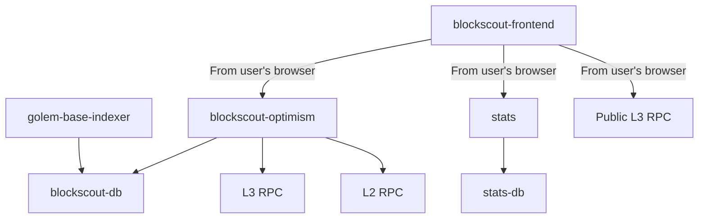

# Arkiv L3 Explorer

## Overview

Arkiv L3 Explorer has a modular, micro-service architecture.

* `blockscout-optimism` - main backend service, responsible for indexing the chain and providing APIs
* `stats` - helper micro-service providing analytics and statistical data
* `blockscout-frontend` - Next.js web application that's the frontend for the Explorer
* `Public L3 RPC`, `L3 RPC`, `L2 RPC` - Ethereum-compatible JSON-RPC endpoints to chain nodes
* `golem-base-indexer` - helper micro-service for indexing entity operations

## Sample deployment

See [example Docker Compose](./kaolin.golem.neti-soft.dev/) project.

## Databases

Arkiv L3 explorer requires 2 separate PostgreSQL databases - one for `blockscout-optimism` and `golem-base-indexer`, and one for `stats`.
It was developed for and tested on PostgreSQL 17, but we expect it to be fully compatible with newer versions as well.

## Services details

### `blockscout-optimism`

This is unmodified upstream Blockscout service in the `Optimism` variant. See [upstream docs](https://docs.blockscout.com/setup/env-variables/backend-env-variables) for a complete reference.

Configuration recommended by us can be found in [the example project](./kaolin.golem.neti-soft.dev/envs/backend.env)

For production deployment, you want to modify the following variables:

* `DATABASE_URL` - `postgresql://` url for DB connection
* `SECRET_KEY_BASE` - secret key for encrypting cookies
* `ETHEREUM_JSONRPC_*` - connection parameters to L3 RPC endpoint. Expect a significant load on the endpoint, as it will fetch all blocks, transactions and traces of transactions.
* `INDEXER_OPTIMISM_L1_RPC` - connection parameters to L2 RPC endpoint. Used for tracking deposits/withdrawals.
* `PORT` - port to listen on
* `COIN_NAME`, `COUNT`, `CHAIN_ID`, `INDEXER_OPTIMISM_L1_SYSTEM_CONFIG_CONTRACT` - adjust based on the L3 chain details.

### `blockscout-frontend`

This is a fork of the upstream frontend, containing modifications related to tracking L3 data. See [upstream docs](https://docs.blockscout.com/setup/env-variables/frontend-common-envs/envs) for a reference of upstream ENVs.

Configuration recommended by us can be found in [the example project](./kaolin.golem.neti-soft.dev/envs/frontend.env)

For production deployment, you want to modify the following variables:

* `NEXT_PUBLIC_APP_HOST` - domain the frontend will be running on
* `NEXT_PUBLIC_NETWORK_RPC_URL` - list of public RPC endpoints for the chain.
* `NEXT_PUBLIC_API_HOST`, `NEXT_PUBLIC_API_BASE_PATH` - connection parameters to `blockscout-optimism`.
* `NEXT_PUBLIC_GOLEM_BASE_INDEXER_API_HOST` - URL to the `golem-base-indexer`
* `NEXT_PUBLIC_ROLLUP_PARENT_CHAIN` - details of the L2 chain
* `NEXT_PUBLIC_ROLLUP_L1_BASE_URL` - URL to an L2 explorer
* `NEXT_PUBLIC_STATS_API_HOST` - connection parameters to `stats` micro-service
* `NEXT_PUBLIC_NETWORK_*` - details of the L3 chain
* `NEXT_PUBLIC_IS_TESTNET` - is this L3 a testnet
* `NEXT_PUBLIC_ROLLUP_L2_WITHDRAWAL_URL` - URL to an app that allows users to trigger withdrawals from L3 to L2
* `NEXT_PUBLIC_TOP_NOTICE_URL` - optional HTML to include at the top of home page
* `NEXT_PUBLIC_UMAMI_*` - optional details for [Umami](https://umami.is/) analytics integration
* `NEXT_PUBLIC_FEATURED_NETWORKS` - details of other explorers that should be linked from this explorer
* `NEXT_PUBLIC_WALLET_CONNECT_PROJECT_ID` - [WalletConnect](https://walletconnect.com/) project ID, for allowing WalletConnect wallet connection
* `NEXT_PUBLIC_OG_DESCRIPTION` - OpenGraph details for the explorer

### `golem-base-indexer`

This is a service responsible for indexing & mapping DB Chain entity operations.

Configuration recommended by us can be found in [the example project](./kaolin.golem.neti-soft.dev/envs/golem-base-indexer.env)

For production deployment, you want to modify the following variables:

* `GOLEM_BASE_INDEXER__DATABASE__CONNECT__URL` - `postgres://` url for accessing the database
* `GOLEM_BASE_INDEXER__SERVER__HTTP__CORS__ALLOWED_ORIGIN` - should be set to the origin of the `blockscout-frontend`
* `GOLEM_BASE_INDEXER__EXTERNAL_SERVICES__L3_RPC_URL` - RPC of the L3 chain
* `GOLEM_BASE_INDEXER__EXTERNAL_SERVICES__L2_BLOCKSCOUT_URL` - link to the L2 explorer
* `GOLEM_BASE_INDEXER__EXTERNAL_SERVICES__L2_BATCHER_ADDRESS` - batched address for this L3 chain
* `GOLEM_BASE_INDEXER__EXTERNAL_SERVICES__L2_BATCH_INBOX_ADDRESS` - batch inbox address for this L3 chain

### `stats`

Configuration recommended by us can be found in [the example project](./l2explorer.arkiv.neti-soft.dev/envs/stats.env)

For production deployment, you want to modify the following variables:

* `STATS__DB_URL` - URL to the `stats-db`
* `STATS__BLOCKSCOUT_DB_URL` - URL to the main blockscout database
* `STATS__BLOCKSCOUT_API_URL=http://backend:4000` - URL to the `blockscout-optimism` service
* `STATS__SERVER__HTTP__CORS__ALLOWED_ORIGIN` - should be set to the origin of the `blockscout-frontend`

## Docker images reference

This project is distributed as a set of Docker images.

* `blockscout-optimism`: `golemnetwork/blockscout-optimism:release-2026-01-22`
* `stats`: `ghcr.io/blockscout/stats:v2.12.0`
* `blockscout-frontend`: `golemnetwork/blockscout-frontend:release-2026-01-22`
* `golem-base-indexer`: `golemnetwork/blockscout-golem-base-indexer:release-2026-01-22`
